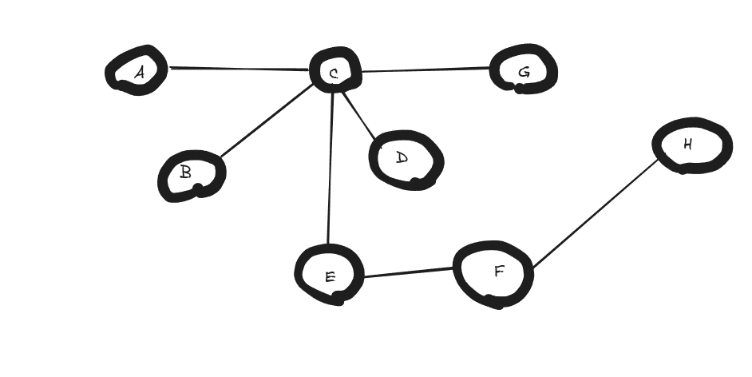
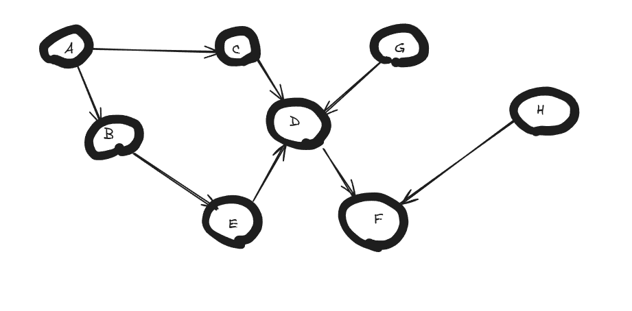
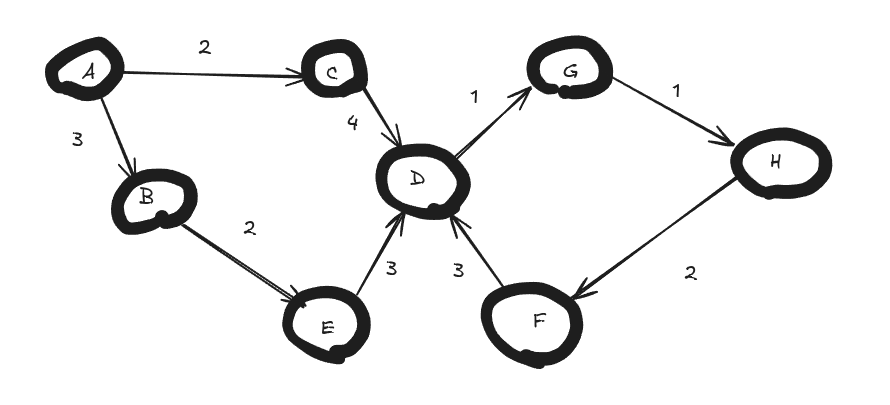

## Week 1 Graph Representations

### Chapter 20.1 Exercise

1. Given an adjacency-list representation of a directed graph, how long does it take to compute the out-degree of every vertex?

**Response:**
It takes O(V + E) where V is the number of vertices and E is the number of edges, this is due to the fact that we must visit each vertex and then each node in its adjacency list to compute the out degree.

2. How long does it take to compute in-degrees?

**Response:**
It takes O(V + E) aswell to compute the total in-degrees because in order to count all the in-degrees we must traverse each vertex (V) and each edge (E) in its adjacency list.

### Extra-CLRS Excersises

1. For each set of properties described below, draw an example graph (8-12 vertices is sufficient) either by hand (then submit a photo) or using a drawing/diagram app (e.g., drawio.com and then upload exported image).

    a. Undirected graph
        

    b. Directed acyclic graph
        
    c. Weighted, directed graph with one or more cycles
        
2. For each one of the graphs you drew above, answer the following questions:

    a. Are the graphs you drew sparse or dense? Explain.

    b. Is the graph connected? What is the fewest number of connections for any one of the vertices? What is the maximum number of connections for any of the vertices?

    c. What real-world scenario/relationships could this kind of graph model?

3. Choose one of your sample graphs and provide representations of that graph in the form of both an adjacency matrix and dictionary-of-adjacency lists, using the style of Python syntax.

ex: 

adjMatrix = [[0,1,1],[1,0,1],[1,1,0]]
adjLists = {"A":["B","C"], "B":["A","C"], "C":["A","B"]}

**Response:**
